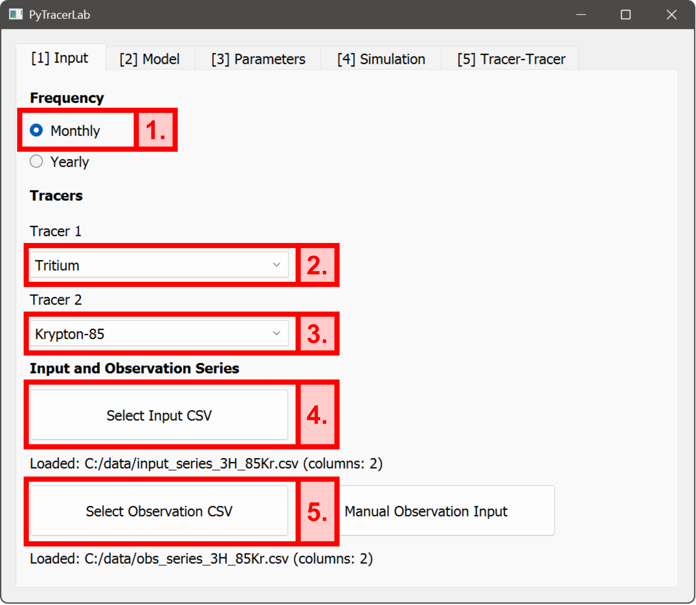
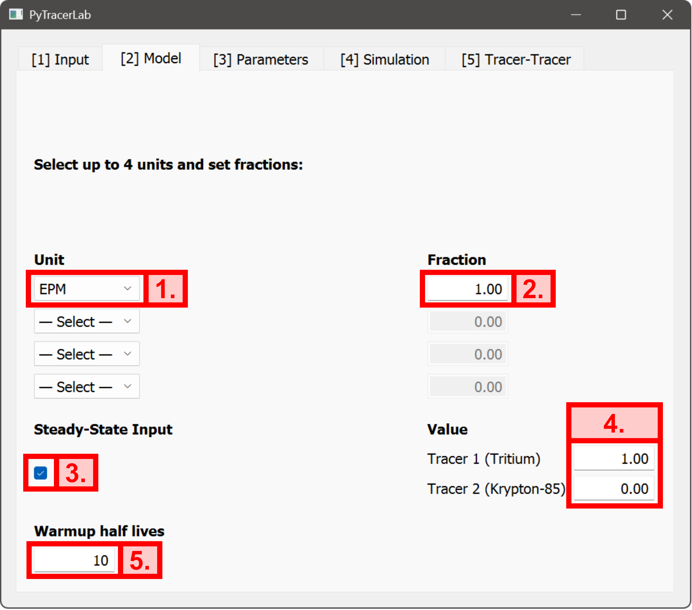
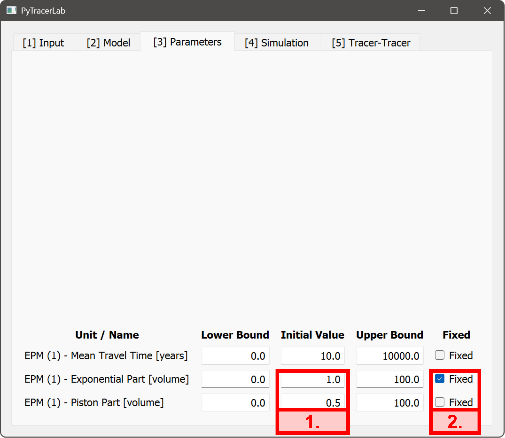
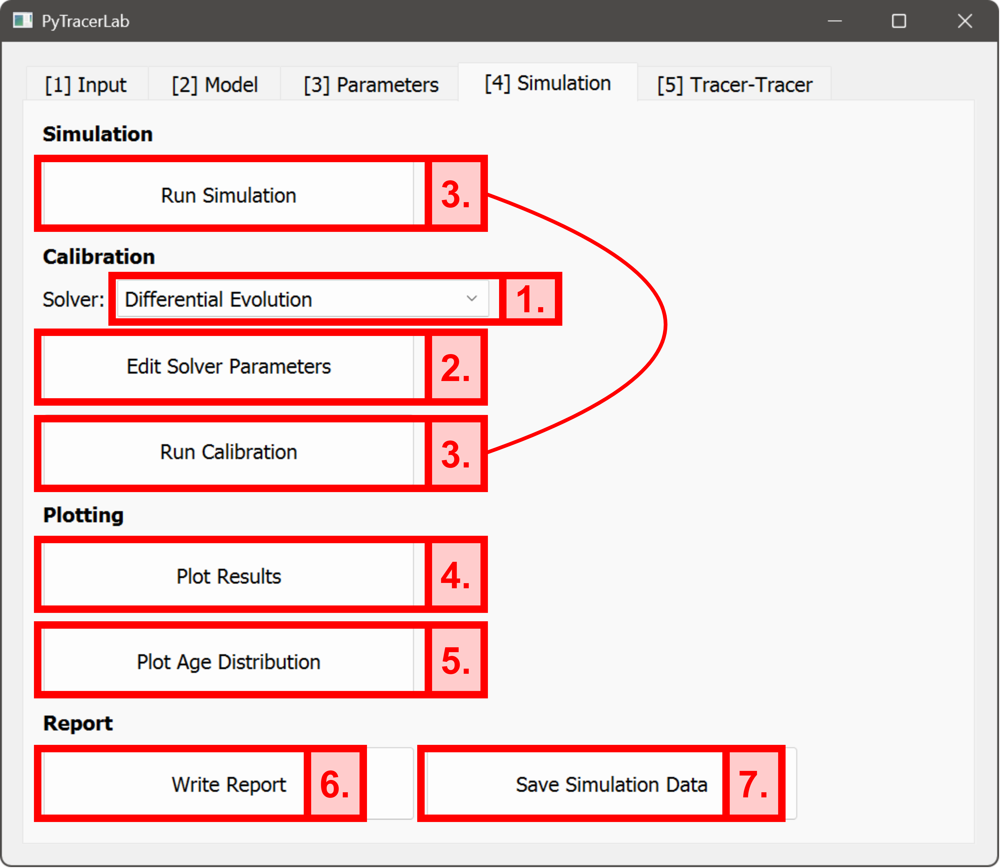
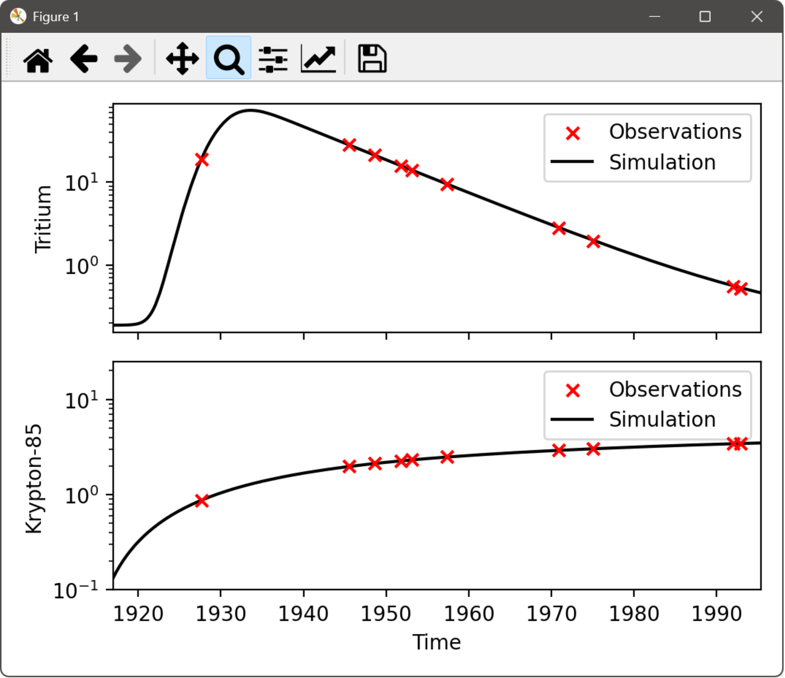
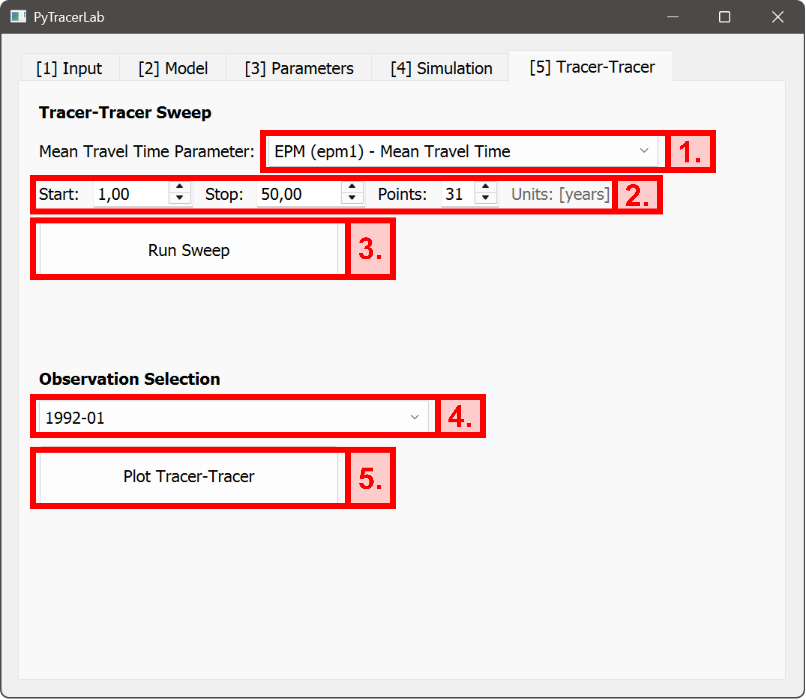
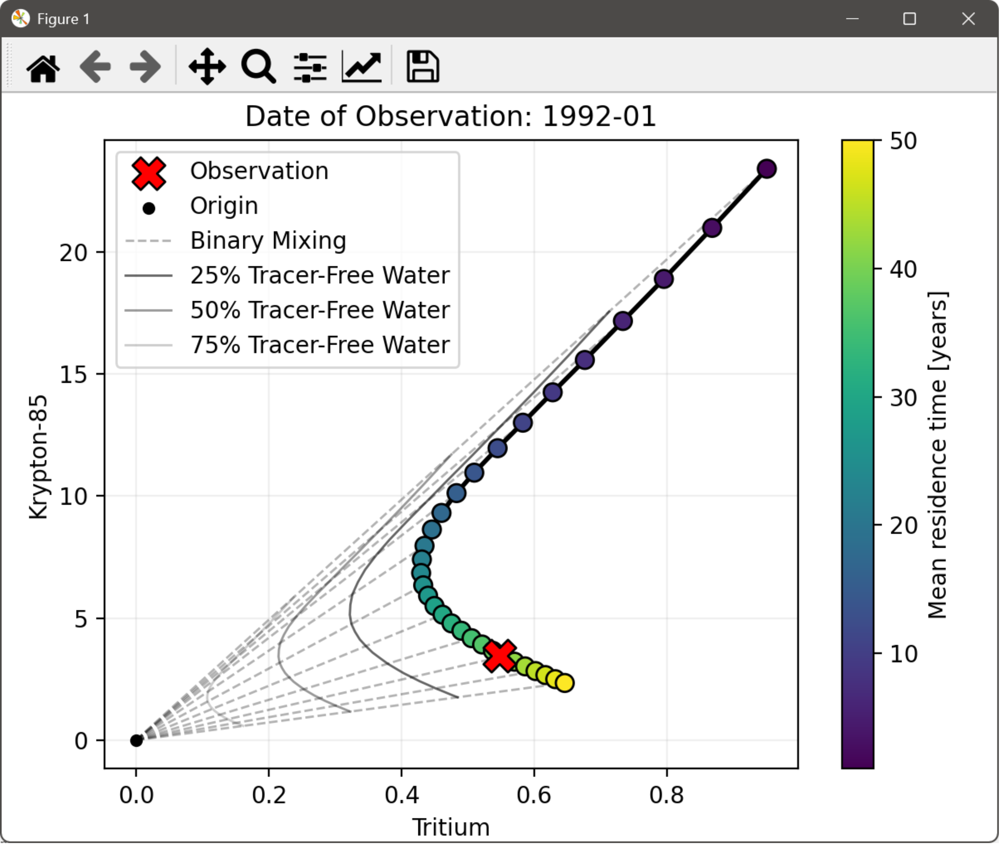

# Using the GUI: a Detailed Example

This example demonstrates the GUI functionality. We use pre-existing data of tracer input and observations that were synthetically generated (see (Example 5)[../examples/example_05]) but the exact same steps can be carried out with any data you may have on hand. This example here considers the case of two tracers (tritium and Kr-85). Observations of tracer concentrations in groundwater are available for a number of dates, where always both tracer concentrations were measured. The GUI can also handle cases where, at certain dates, only one of the tracers is observed. See the [user guide](usage.md) for more information.

```{tip}
Refer to this guide when encountering problems with the GUI. Most of the functionality of the GUI is covered here, which should answer most of the questions that may come up.
```

## Loading Data
We use tritium and Kr-85 input (examples/example_input_series_2tracer.csv) and output (examples/example_observation_series_2tracer.csv) data and perform the basic model settings in the input tab:
1. Set the model resolution to `Monthly`. This settings decides on how the input data should look like and vice versa.
2. Select `Tritium` as the first tracer; corresponding data is in the **first column** of model input and observation data.
3. Select `Krypton-85` as the second tracer; corresponding data is in the **second column** of model input and observation data.
4. Select the input file `example_input_series_2tracer.csv` using the file dialog that opens when you click on the button.
5. Select the observation file `example_observation_series_2tracer.csv` using the file dialog that opens when you click on the button.

```{tip}
It is also possible to manually enter observation data in the GUI. If you want to use this feature, **do not** enter an obervation file before. This should then replace step 5 from before.
```



## Model Setup
In this example there is a true known reference model, which is not available in practice. The model structure that is created in this tab should always be based on a conceptual understanding of the groundwater flow system under study. See the [user guide](usage.md) for more information. In the present example we set up the model structure such that it resembles the true reference model structure. We also use the correct ratio of piston-flow-volume and exponential-flow-volume. Again, this would not be possible in practice and careful model conceptualization is required here. We create the model stucture involving the following steps:
1. Select the EPM (Exponential Piston Flow Model) from the list.
2. Enter the fraction of the overall model output that is represented by this model unit. Here the EPM is the only model unit, so we have to use a value of `1.0` here. If we had multiple model units in parallel, their respective fractions can be different, but they have to sum to `1.0` (e.g., `0.7` and `0.3` for two units in parallel).
3. Enable steady-state tracer input.
4. Enter steady-state tracer input concentrations (`1.0` for tritium, `0.0` for Krypton-85).
5. Set the model warmup period (default is `10` half-lives of the tracer with the higher half life).

```{tip}
Using multiple model units in parallel enables the representation of more complex aquifer scenarios. For example, consider the case where the sampled well penetrates two aquifers separated by a confining unit. The well water then is a mixture of different waters with different groundwater flow and travel time characteristics. Using, e.g., two units in parallel enables a more detailed representation of such cases.
```



## Set Model Parameters
The parameter settings entered in the corresponding tab are used in different places of the software. The `Initial Value` is always used for regular simulations triggered with `Run Simulation` and also serves as the initial value for model calibration. Lower and upper bounds of parameters are also used during calibration. Parameters that should remain at their initial values at all times can be held constant via enabling the `Fixed`-box of the corresponding parameter. In the current example, we perform the following steps on this tab:
1. Enter a volume of `1.0` for the exponential part of the model and enter a volume of `0.5` for the piston flow part of the model.
2. Ensure that the value of either the exponential part or the piston part is fixed (not both fixed and not both un-fixed).

```{warning}
When the Exponential Piston Flow Model (EPM) is selected as a model unit, the parameters controlling the respective portions of exponential and piston flow parts are both initialized as fixed parameters. This is because it is not possible to calibrate both parameters at once due to the fact that the same ratio of exponential and piston flow parts can be achieved with an infinite number of values (i.e., 1/2 = 2/4 = 4/8 = ... = 0.5).
```



## Run a Simulation and / or Calibrate Model Parameters
In most applications, it is necessary to either perform simple simulations (or forward runs) with defined parameter values or to calibrate model parameters on the basis of available observation data. In both cases it is typically required to plot model results, plot the travel time distribution, and to export results and simulated data. In the current case, model calibration is performed using a `Differential Evolution` optimization approach. In the present example, we perform the following steps:
1. Select `Differential Evolution` as solver.
2. Potentially edit solver parameters (parameters are not changed in this example but would be changed at this stage if necessary).
3. Run the model calibration. If a simple simulation (forward run) should be performed, the first two steps can be skipped and a simulation can be run as a first step.
4. Plot results.
5. Plot the travel time distribution.
6. Write the model report (store the file at a certain location using the file dialog).
7. Save simulation data (store the file at a certain location using the file dialog).

```{tip}
Different calibration aproaches are available in PyTracerLab. All those approaches can be further controlled in their behaviour via `Edit Solver Parameters`.
```

```{warning}
Solver parameters are generally set at robust defaults. They should only be changed if you know what you are doing. Check the API documentation for further information and also check existing literature on how the different approaches work (least squares, differential evolution, Metropolis-Hastings MCMC, DREAM MCMC).
```





## Perform Tracer-Tracer Analysis
To perform analysis involving multiple tracers, the `Tracer-Tracer` tab of the GUI can be used. At the moment, the GUI is limited to the analysis of at most 2 tracers in parallel, this limitation does not exit with the Python package. After a model structure is specified (potentially involving multiple model units), tracer-tracer analysis performs a number of model simulations with different values of **one** mean travel time parameter - if more than one model units is used, one mean travel time parameter has to be specified that is changed during the analysis. In the present example, only one model unit is considered and only one mean travel time parameter exists in the model. For the different mean travel time parameter values (typically spanning a certain range, e.g., 1 to 50 years), the model is then simulated and the resulting time series of simulated concentrations is stored. In the last step of the analysis, it is possible to select an available observation date (from all available dates that have an observed value attached to it) for which a tracer-tracer plot can be generated. In this example, we perform the following steps:
1. Select the `Mean Travel Time Parameter`, that should be changed during the analysis, from the list.
2. Set the starting point and endpoint for the analysis as well as the total number of mean travel time values to use during the analysis. This defines the "sweep range".
3. Run the "sweep" of different mean travel time values.
4. Select an observation date from the list of available observation dates.
5. Generate the tracer-tracer plot for this observation date.




