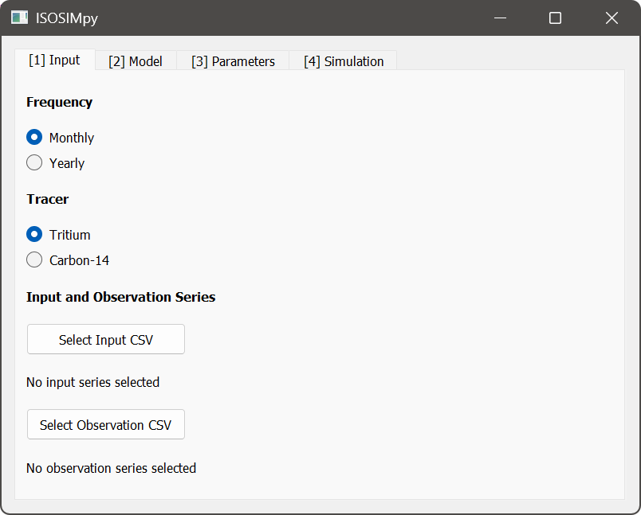
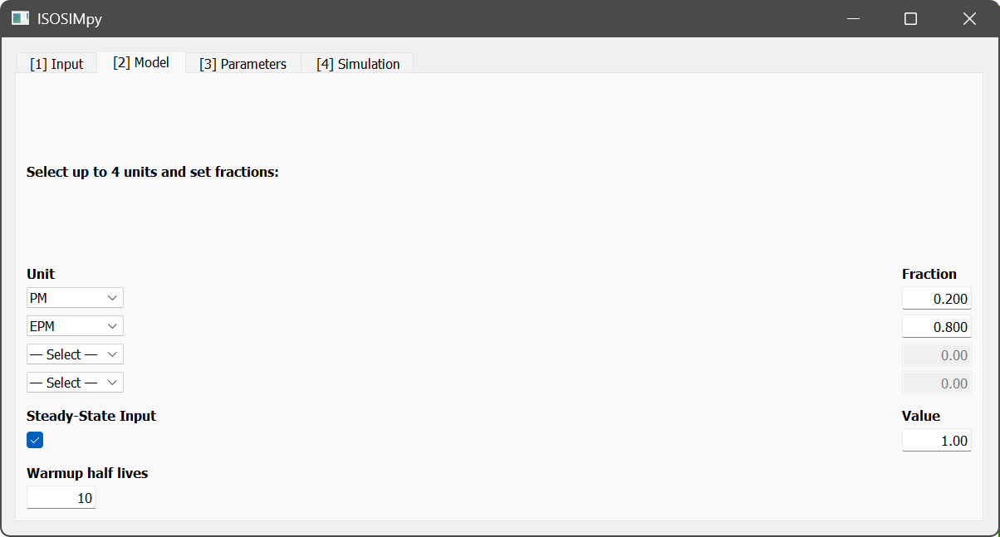
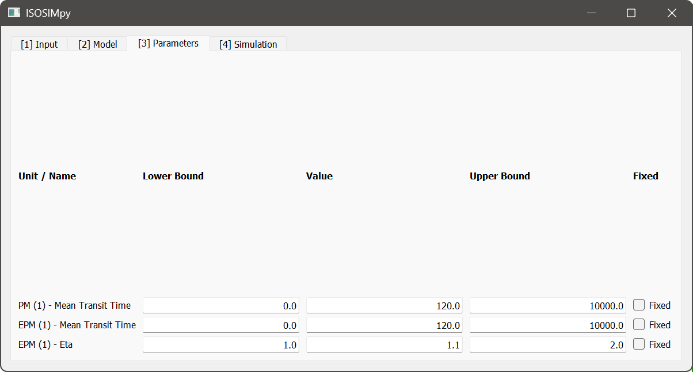
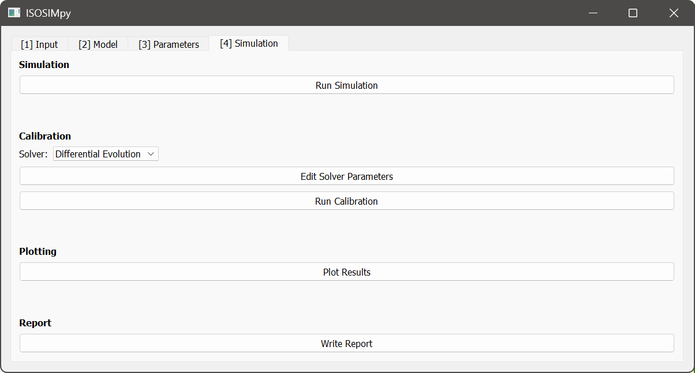
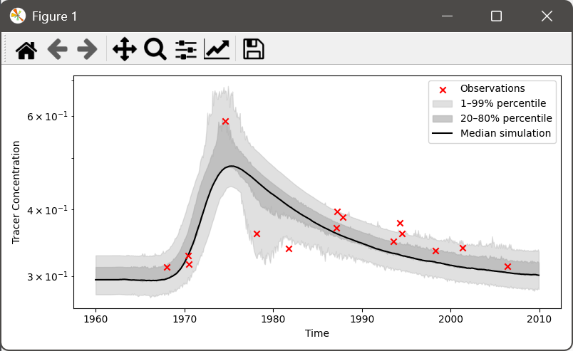
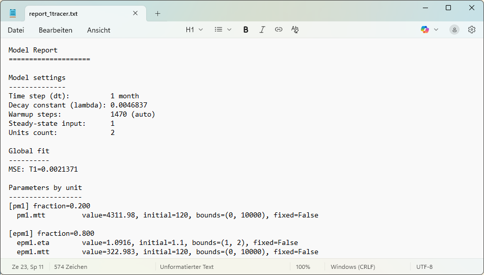

# Using PyTracerLab
## Using the Graphical User Interface
In general, using the Graphical User Interface (GUI) is stricter and less versatile than using the package it is built on. Specifically, the app assumes a certain structure of time series data, is not scalable well to handle many different datasets, and offers limited post-processing functionality. Nevertheless, the GUI is a highly user-friendly option to performing analysis of groundwater residence time distributions using lumped parameter models.

The GUI is structured into different **Tabs**. Those **Tabs** represent the typical workflow and should be considered in their present order. The individual **Tabs** are described in more detail below.

### 1. The Input Tab
In this **Tab**, datasets are loaded and the most basic settings for subsequent modelling are made.
- select temporal resolution (yearly or monthly data in time series and model simulations)
- select one or two tracers to be considered in the analysis ($^3\mathrm{H}$ or $^14\mathrm{C}$)
- select and load tracer input time series file using the file dialog that opens up; see [here](#preparing-datasets) for details on how to prepare tracer input time series files
- select and load tracer observation time series file using the file dialog that opens up; see [here](#preparing-datasets) for details on how to prepare tracer observation time series files

**Note**: the same units of tracer concentration should be used in both the tracer input data and the observation data. Units are not checked internally. **If units are not equal, unwanted and wrong results are obtained!**



### 2. The Model Tab
In this **Tab**, the different model parts are selected that are included in the simulations.
- select up to 4 model units to be used in parallel
    - available units:
        - Piston-Flow Model (**PM**)
        - Exponential Model (**EM**)
        - Exponential Piston-Flow Model (**EPM**)
        - Dispersion Model (**DM**)
    - each unit is associated with a corresponding fraction of the total system response or output; the fractions of all active units need to sum to units, otherwise an error is raised, and the model will not run
- specify if there is a steady state tracer input that should be considered for the time prior to the start of the datasets
- specify the warmup time span
    - this prepends the steady state tracer input for the time of the number of tracer half lives specified here
    - model warmup helps to remove unwanted irregularities that can appear in early phases of simulations; see [here](#model-warmup) for more details
    - in the case of two tracers, **the longer of the two half lives is used**

**Note**: the steady state input value is interpreted in the same units that are used in the tracer input and observation datasets. Units are not checked internally. **If units are not equal, unwanted and wrong results are obtained!**



### 3. The Parameters Tab
In this **Tab**, settings are made regarding model parameters, how they are bounded during calibration, and what current values they take.
- specify the lower bound, current value, upper bound, and calibration status for all model parameters; different model parameters are organized in rows
    - the value that is specified for a parameter will be used as its value for simple simulation and as the initial value for calibration
    - parameters that are set to *fixed* remain at their specified value during calibration

**Note**: parameter time units are always in months. Half lives are internally converted but other parameters having time units are interpreted in months.



### 4. The Simulation Tab
In this **Tab**, simulations can be performed, model parameters can be calibrated automatically, results can be plotted, and reports can be generated.
- perform a model simulation using the current parameters
- perform model calibration
    - select a solver
    - change solver parameters (requires at lease a basic understanding of the solvers)
    - run automatic calibration
- plot results of current simulation / calibrated model simulation
- write a report including the calibrated parameters, error metrics, and other model details to a text file; uses a file dialog to store the report file







(preparing-datasets)=
## Preparing Datasets
Datasets need to be prepared in a specific way in order for the app to be able to read the data. Files always have to be CSVs. The tracer input and observation time series data has to be of the same length. Time stamps which are present in the tracer input series but for which no observation is available have to be marked as missing values (see below). It is assumed that the time series do not have gaps and are processed accordingly before use in PyTracerLab.

Below, instead of "# Date, CTracer" or "# Date, CTracer1, CTracer2", any other description can be used. **The first line in the file is skipped when reading!**

### Montly Data
#### A Single Tracer
**Monthly tracer input series** should have the following format if **a single tracer** is considered:

```
# Date, CTracer
1996-01, 1.03
1996-02, 2.12
1996-03, 0.08
...
2009-11, 0.05
```

**Monthly tracer observation series** should have the following format if **a single tracer** is considered ("nan" if no observation is available at that time stamp):

```
# Date, CTracer
1996-01, nan
1996-02, 0.17
1996-03, nan
...
2009-11, nan
```

#### Two Tracers
**Monthly tracer input series** should have the following format if **two tracers** are considered:
```
# Date, CTracer1, CTracer2
1996-01, 1.03, 0.01
1996-02, 2.12, 0.06
1996-03, 0.08, 0.02
...
2009-11, 0.05, 1.25
```

**Monthly tracer observation series** should have the following format if **two tracers** are considered ("nan" if no observation is available at that time stamp):
```
# Date, CTracer1, CTracer2
1996-01, nan, nan
1996-02, 1.14, 0.01
1996-03, nan, nan
...
2009-11, nan, nan
```

### Yearly Data
#### A Single Tracer
**Yearly tracer input series** should have the following format if **a single tracer** is considered:

```
# Date, CTracer
1996, 1.03
1997, 2.12
1998, 0.08
...
2009, 0.05
```

**Yearly tracer observation series** should have the following format if **a single tracer** is considered ("nan" if no observation is available at that time stamp):

```
# Date, CTracer
1996, nan
1997, 0.17
1998, nan
...
2009, nan
```

#### Two Tracers
**Yearly tracer input series** should have the following format if **two tracers** are considered:
```
# Date, CTracer1, CTracer2
1996, 1.03, 0.01
1997, 2.12, 0.06
1998, 0.08, 0.02
...
2009, 0.05, 1.25
```

**Yearly tracer observation series** should have the following format if **two tracers** are considered ("nan" if no observation is available at that time stamp):
```
# Date, CTracer1, CTracer2
1996, nan, nan
1997, 1.14, 0.01
1998, nan, nan
...
2009, nan, nan
```

(model-warmup)=
## Model Warmup
