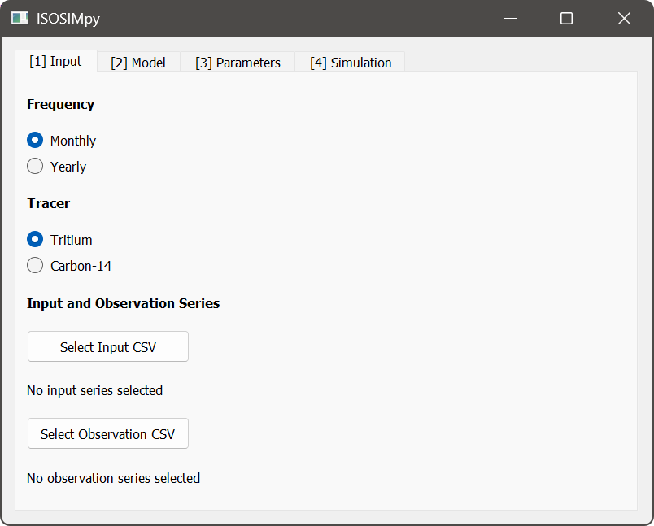
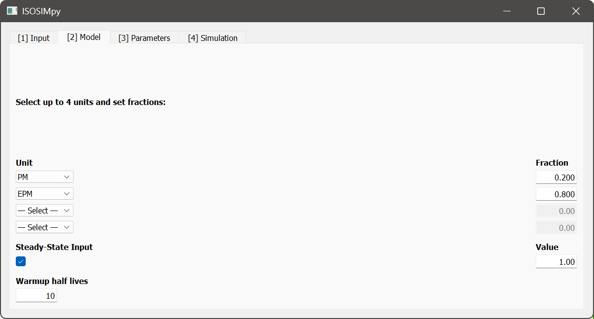
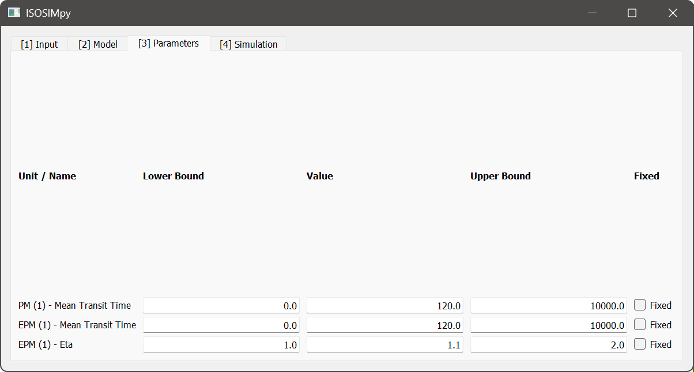
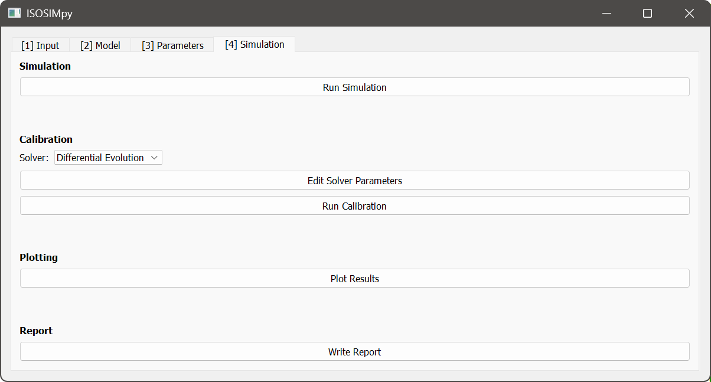
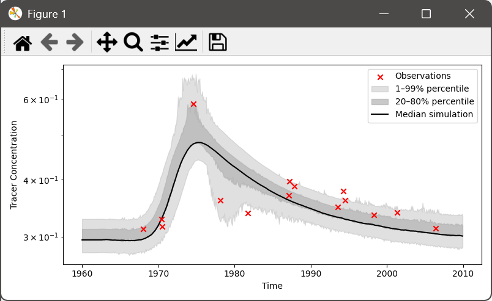
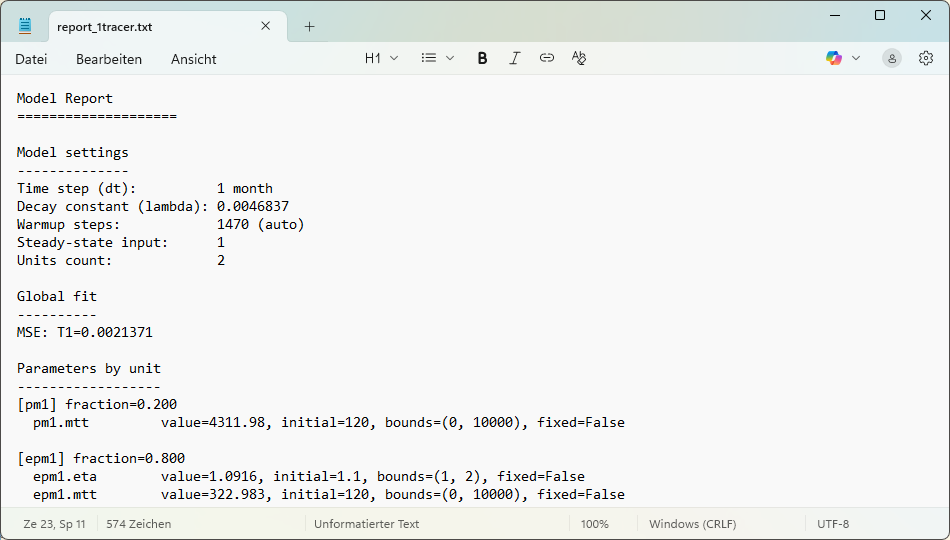

# Verwendung von PyTracerLab

(get-running-de)=
## PyTracerLab auf Ihrem Rechner zum Laufen bringen

Dieser Abschnitt richtet sich an Leserinnen und Leser, die GitHub noch nie verwendet haben und das
Programm einfach nur auf ihrem Rechner haben möchten. Er beschreibt **jeden einzelnen Klick** von der
PyTracerLab-Projektseite bis zum geöffneten PyTracerLab-Fenster. Programmierkenntnisse, eine
Python-Installation oder ein GitHub-Konto sind nicht erforderlich.

```{note}
Die Benutzeroberfläche von GitHub ist standardmäßig englischsprachig. Die Namen der Schaltflächen und
Bereiche werden deshalb im Folgenden **auf Englisch (fett)** angegeben — genau so, wie sie auf dem
Bildschirm erscheinen — jeweils mit einer deutschen Erläuterung.
```

**Was Sie benötigen:**

- einen PC mit **Windows 10 oder Windows 11**
- eine Internetverbindung
- etwa **500 MB freien Speicherplatz** (die Programmdatei selbst ist rund 91 MB groß und entpackt
  sich bei jedem Start vorübergehend selbst)
- ungefähr **5 Minuten**

Sie benötigen **keine** Administratorrechte, und es wird nichts in die Systemordner von Windows
geschrieben.

```{note}
**Dieser Weg funktioniert nur unter Windows.** Wenn Sie macOS oder Linux verwenden oder wenn Ihr
Rechner von einer IT-Abteilung verwaltet wird, die Programme unbekannter Herausgeber blockiert,
folgen Sie stattdessen der Anleitung [Running PyTracerLab Locally](local_installation.md) (auf
Englisch). Dort wird PyTracerLab als Python-Programm installiert, was auf jedem Betriebssystem
funktioniert.
```

### Schritt 1 — Die PyTracerLab-Seite auf GitHub öffnen

Öffnen Sie Ihren Webbrowser und rufen Sie folgende Adresse auf:

<https://github.com/iGW-TU-Dresden/PyTracerLab>

GitHub ist die Website, auf der der Quellcode von PyTracerLab und das fertige Programm abgelegt sind.
Die Seite, auf der Sie landen, wird *Repository* (Projektablage) genannt. Sie benötigen **kein**
GitHub-Konto und müssen sich **nicht** anmelden — alles in dieser Anleitung funktioniert ohne Konto.

In der Mitte der Seite sehen Sie eine Liste von Ordnern und Dateien (`docs`, `src/PyTracerLab`,
`LICENSE` und so weiter). **Diese können Sie vollständig ignorieren.** Was Sie brauchen, befindet sich
auf der rechten Seite.

### Schritt 2 — Den Bereich "Releases" rechts finden

Schauen Sie auf die **rechte Spalte** der Seite. Von oben nach unten enthält sie einen Bereich
**About** (Kurzbeschreibung des Projekts) und darunter einen Bereich mit der Überschrift **Releases**
(Veröffentlichungen). Im folgenden Bild ist er rot umrandet.


Ein *Release* ist eine fertige, verpackte Version des Programms. Der Bereich **Releases** zeigt die
neueste Version, gekennzeichnet mit einer grünen Markierung **Latest** (neueste) — zum Zeitpunkt der
Erstellung dieser Anleitung ist das **v0.2.9**. Die bei Ihnen angezeigte Versionsnummer ist
wahrscheinlich höher; das ist richtig und zu erwarten.


```{tip}
**Sie sehen den Bereich "Releases" nicht?** Wenn Ihr Browserfenster schmal ist, verschiebt GitHub die
gesamte rechte Spalte an das **untere Ende** der Seite. Scrollen Sie entweder ganz nach unten oder
vergrößern Sie das Browserfenster (bzw. klicken Sie auf die Schaltfläche zum Maximieren oben rechts
im Fenster).
```

### Schritt 3 — Die Liste der Releases öffnen

Klicken Sie im Bereich **Releases** auf die Versionsnummer selbst (zum Beispiel **v0.2.9**) oder auf
den blauen Link **+ 19 releases** direkt darunter. Beides führt an dieselbe Stelle: zur Seite mit
allen veröffentlichten Versionen.

### Schritt 4 — Die Download-Dateien finden ("Assets")

Die Seite, auf der Sie sich jetzt befinden, listet alle veröffentlichten Versionen auf, **die neueste
zuerst**. Die neueste Version steht ganz oben und trägt die grüne Markierung **Latest**.

Suchen Sie unterhalb dieser neuesten Version die Überschrift **Assets** mit einer kleinen Zahl
daneben. "Assets" ist die Bezeichnung von GitHub für *die Dateien, die zu dieser Version
heruntergeladen werden können*. Die Liste ist normalerweise bereits aufgeklappt. Sehen Sie
stattdessen nur ein kleines Dreieck **▸ Assets**, klicken Sie einmal auf das Wort **Assets**, um die
Liste aufzuklappen.


### Schritt 5 — Die richtige Datei herunterladen

Die Liste **Assets** enthält fünf Einträge. Nur **einer** davon ist das Programm:

| Datei in der Liste | Was es ist | Brauchen Sie das? |
| --- | --- | --- |
| `pytracerlab-0.2.9-py3-none-any.whl` | Python-Paket | Nein |
| `pytracerlab-0.2.9.tar.gz` | Python-Quellpaket | Nein |
| **`PyTracerLab-v0.2.9.exe`** | **Das fertige Programm** | **Ja — diese hier** |
| `Source code (zip)` | Der Quellcode | Nein |
| `Source code (tar.gz)` | Der Quellcode | Nein |

**Klicken Sie auf die Datei, deren Name auf `.exe` endet** — im Bild oben ist sie rot umrandet. Die
Zahl im Dateinamen ist die Versionsnummer und wird bei neueren Releases höher als `0.2.9` sein;
nehmen Sie immer die `.exe`-Datei, unabhängig von ihrer Versionsnummer.

Die Datei ist etwa **91 MB** groß, der Download dauert daher einen Moment. Ihr Browser zeigt den
Fortschritt an.

### Schritt 6 — Die Download-Warnung des Browsers bestätigen

Ihr Browser wird Sie sehr wahrscheinlich vor dieser Datei warnen, etwa mit Formulierungen wie *"Diese
Datei wird nicht häufig heruntergeladen"* oder *"… wurde blockiert, da sie Ihr Gerät schädigen
könnte"*.

Diese Warnung erscheint, weil die Datei nicht mit einem kostenpflichtigen Signaturzertifikat digital
signiert ist. PyTracerLab ist freie akademische Software und besitzt kein solches Zertifikat. Die
Warnung sagt nichts über den Inhalt der Datei aus — sie erscheint bei jedem heruntergeladenen
Programm ohne ein solches Zertifikat.

So behalten Sie die Datei:

- **Google Chrome** — der Download erscheint in einem kleinen Feld oben rechts im Browser. Fahren Sie
  mit der Maus über den Eintrag, klicken Sie auf die **⋮** (drei Punkte) daneben und wählen Sie
  **Beibehalten** (*Keep*).
- **Microsoft Edge** — an derselben Stelle, oben rechts. Klicken Sie auf die **⋯** (drei Punkte)
  neben dem blockierten Download, wählen Sie **Beibehalten** (*Keep*), dann **Mehr anzeigen**
  (*Show more*) → **Trotzdem beibehalten** (*Keep anyway*).
- **Mozilla Firefox** — klicken Sie auf den Download-Pfeil in der Symbolleiste, klicken Sie mit der
  rechten Maustaste auf den Eintrag und wählen Sie **Download erlauben**.

### Schritt 7 — Die heruntergeladene Datei auf dem Rechner finden

Die Datei liegt jetzt in Ihrem Ordner **Downloads**, normalerweise:

```
C:\Users\<Ihr Windows-Benutzername>\Downloads
```

Öffnen Sie dazu den **Datei-Explorer** (das gelbe Ordnersymbol in der Taskleiste oder die
Tastenkombination `Windows + E`) und klicken Sie in der linken Spalte auf **Downloads**. Gesucht ist
die Datei **`PyTracerLab-v0.2.9.exe`**.

```{important}
**Diese eine Datei *ist* das gesamte Programm.** Es gibt nichts zu installieren. Es wird kein Eintrag
im Startmenü und kein Symbol auf dem Desktop angelegt. Sie können die Datei beliebig verschieben —
zum Beispiel auf den Desktop oder in einen Ordner Ihrer Wahl — und von dort starten. Wenn Sie die
Datei löschen, ist das Programm von Ihrem Rechner verschwunden.
```

### Schritt 8 — Das Programm starten und die Windows-Warnung bestätigen

**Doppelklicken** Sie auf die Datei `PyTracerLab-v0.2.9.exe`.

Windows zeigt daraufhin höchstwahrscheinlich ein blaues Fenster mit dem Titel **"Der Computer wurde
durch Windows geschützt"** (englisch: *"Windows protected your PC"*). Zunächst scheint dieses Fenster
nur eine einzige Schaltfläche anzubieten: **Nicht ausführen** (*Don't run*).

Gehen Sie so vor:

1. Klicken Sie auf den kleinen Link **Weitere Informationen** (*More info*) direkt unter dem
   Meldungstext.
2. Das Fenster klappt auf und zeigt nun den Dateinamen, den Herausgeber — und unten rechts eine neue
   Schaltfläche **Trotzdem ausführen** (*Run anyway*).
3. Klicken Sie auf **Trotzdem ausführen**.

Diese Warnung hat dieselbe Ursache wie die Download-Warnung in Schritt 6: Das Programm ist nicht mit
einem kostenpflichtigen Zertifikat signiert. Sie müssen sie pro heruntergeladener Datei nur einmal
bestätigen.

```{tip}
Sie können die Warnung auch vorab entfernen: Klicken Sie mit der rechten Maustaste auf die Datei,
wählen Sie **Eigenschaften** und setzen Sie unten im Reiter **Allgemein** das Häkchen bei
**Zulassen** bzw. **Blockierung aufheben** (*Unblock*). Bestätigen Sie anschließend mit **OK**.
```

### Schritt 9 — Auf den ersten Start warten

```{warning}
**Für 10 bis 40 Sekunden scheint nichts zu passieren.** Das ist normal.
```

Das Programm ist in eine einzige Datei gepackt und muss sich zunächst in einen temporären Ordner
entpacken, bevor das Fenster erscheinen kann. Beim ersten Start dauert das merklich länger als später.
Währenddessen gibt es weder einen Fortschrittsbalken noch einen Startbildschirm.

**Doppelklicken Sie die Datei in dieser Zeit nicht erneut** — damit starten Sie lediglich eine zweite
Kopie des Programms. Warten Sie, bis das Fenster erscheint. Spätere Starts gehen deutlich schneller.

### Schritt 10 — Das Programm läuft

Das PyTracerLab-Hauptfenster öffnet sich mit dem Eingabe-Tab und sieht so aus:



Das war's — PyTracerLab läuft. Machen Sie weiter mit [Der Eingabe-Tab](#input-tab-de), wo erklärt
wird, was als Nächstes zu tun ist. Wenn Sie eine vollständige Analyse von Anfang bis Ende begleitet
durchführen möchten, lesen Sie
[Verwendung der GUI: ein detailliertes Beispiel](detailed_example_de.md).

### PyTracerLab später erneut starten

Es muss nichts weiter installiert werden. Wann immer Sie PyTracerLab wieder verwenden möchten,
doppelklicken Sie einfach dieselbe `.exe`-Datei. Die Windows-Warnung aus Schritt 8 erscheint für diese
Datei nicht erneut.

### Auf eine neuere Version aktualisieren

PyTracerLab aktualisiert sich **nicht** selbst. Um auf eine neuere Version zu wechseln, wiederholen
Sie die Schritte 1 bis 8 — Sie erhalten dann eine `.exe`-Datei mit einer höheren Versionsnummer. Die
alte Datei können Sie anschließend löschen.

### Wenn etwas nicht funktioniert hat

**Ich habe doppelgeklickt und es passiert nichts.**
Warten Sie eine volle Minute — siehe Schritt 9. Erscheint immer noch kein Fenster, öffnen Sie den
Windows **Task-Manager** (`Strg + Umschalt + Esc`) und prüfen Sie, ob `PyTracerLab` unter *Prozesse*
aufgeführt ist. Sind dort mehrere Kopien gelistet, beenden Sie alle und versuchen es mit einem
einzelnen Doppelklick erneut.

**Das Fenster "Der Computer wurde durch Windows geschützt" hat keine Schaltfläche "Trotzdem ausführen".**
Die Schaltfläche wird erst sichtbar, nachdem Sie auf **Weitere Informationen** geklickt haben — siehe
Schritt 8. Wenn die IT-Richtlinie Ihres Arbeitgebers unsignierte Programme grundsätzlich blockiert,
kann die Schaltfläche ganz fehlen. Verwenden Sie in diesem Fall
[Running PyTracerLab Locally](local_installation.md).

**Die Datei ist nach dem Herunterladen verschwunden.**
Ihre Antivirensoftware hat sie in Quarantäne verschoben. So verpackte Programme lösen häufig
Fehlalarme aus. Stellen Sie die Datei aus der Quarantäneliste Ihres Antivirenprogramms wieder her
oder verwenden Sie [Running PyTracerLab Locally](local_installation.md).

**Das Fenster erscheint kurz und schließt sich sofort wieder.**
Dieser Weg startet das Programm bewusst ohne Konsolenfenster, sodass eine mögliche Fehlermeldung
unsichtbar bleibt. Um zu sehen, was schiefgelaufen ist, installieren Sie PyTracerLab gemäß
[Running PyTracerLab Locally](local_installation.md) als Python-Programm und starten es mit dem Befehl
`PyTracerLab` — diese Variante behält ein Konsolenfenster geöffnet, in dem die Fehlermeldung angezeigt
wird. Bitte melden Sie die Meldung über
[GitHub Issues](https://github.com/iGW-TU-Dresden/PyTracerLab/issues).

**Ich verwende kein Windows.**
Die `.exe`-Datei läuft nur unter Windows. Folgen Sie
[Running PyTracerLab Locally](local_installation.md); diese Anleitung funktioniert auch unter macOS
und Linux.

## Verwendung der grafischen Benutzeroberfläche
Im Allgemeinen ist die Verwendung der grafischen Benutzeroberfläche (GUI) strikter und weniger vielseitig als die Verwendung des zugrunde liegenden Pakets. Konkret setzt die App eine bestimmte Struktur der Zeitreihendaten voraus, lässt sich nicht gut skalieren, um viele unterschiedliche Datensätze zu verarbeiten, und bietet nur begrenzte Nachbearbeitungsfunktionen. Dennoch ist die GUI eine sehr benutzerfreundliche Option, um Analysen von Grundwasserlaufzeitverteilungen mit Lumped-Parameter-Modellen durchzuführen.

```{important}
Die GUI kann nur Eingangs- und Beobachtungsdateien einlesen, die einer bestimmten Struktur folgen: CSV-Dateien mit Kommas als Trennzeichen, eine erste Zeile, die als Kopfzeile übersprungen wird, eine Datumsspalte im Format `YYYY-MM` (monatliche Daten) oder `YYYY` (jährliche Daten), eine oder zwei Tracer-Spalten, Eingangs- und Beobachtungsreihen derselben Länge sowie `nan` für fehlende Beobachtungen. Eine ausführliche Beschreibung der erforderlichen Dateistruktur finden Sie unter [Vorbereitung der Datensätze](#preparing-datasets-de).
```

(example-datasets-de)=
### Beispieldateien
Die folgenden Beispieldateien können heruntergeladen und direkt in die GUI geladen werden. Sie decken verschiedene Anwendungsfälle hinsichtlich der zeitlichen Auflösung und der Anzahl der Tracer ab. Wählen Sie beim Laden einer Datei auf dem Eingabe-Tab die zeitliche Auflösung und den bzw. die Tracer, die zur Datei passen.

| Eingangsdatei | Beobachtungsdatei | Auflösung | Tracer | Zeitraum | Hinweise |
| --- | --- | --- | --- | --- | --- |
| {download}`example_input_series_1tracer.csv <../examples/example_input_series_1tracer.csv>` | {download}`example_observation_series_1tracer.csv <../examples/example_observation_series_1tracer.csv>` | monatlich | 1 | 1960-01 – 2009-12 | |
| {download}`example_input_series_2tracer.csv <../examples/example_input_series_2tracer.csv>` | {download}`example_observation_series_2tracer.csv <../examples/example_observation_series_2tracer.csv>` | monatlich | 2 (Tritium, Krypton-85) | 1900-01 – 1999-12 | verwendet im [detaillierten Beispiel](detailed_example_de.md) |
| {download}`TracerLPM_benchmark_input_yearly.csv <../examples/TracerLPM_benchmark_input_yearly.csv>` | {download}`TracerLPM_benchmark_observations_yearly.csv <../examples/TracerLPM_benchmark_observations_yearly.csv>` | jährlich | 1 | 1850 – 2020 | TracerLPM-Benchmark |
| {download}`3H_SF6_input.csv <../examples/3H_SF6_input.csv>` | {download}`3H_SF6_observations.csv <../examples/3H_SF6_observations.csv>` | jährlich | 2 (Tritium, SF6) | 1900 – 2020 | SF6 ist nicht in der Tracer-Liste der GUI enthalten; wählen Sie dafür *Stable tracer (no decay)* |
| {download}`input_monthly_modflow.csv <../examples/input_monthly_modflow.csv>` | – | monatlich | 1 | 1970-01 – 2019-12 | keine Beobachtungsdatei; Beobachtungen über *Manual Observation Input* eingeben |
| {download}`benchmark_input_monthly.csv <../examples/benchmark_input_monthly.csv>` | – | monatlich | 1 | 1960-01 – 1969-12 | Impulseingang zur Untersuchung der Modellantwort |
| {download}`benchmark_input_yearly.csv <../examples/benchmark_input_yearly.csv>` | – | jährlich | 1 | 1960 – 1969 | Impulseingang zur Untersuchung der Modellantwort |

### Aufbau der GUI
Die GUI ist in verschiedene **Tabs** gegliedert. Diese **Tabs** repräsentieren den typischen Arbeitsablauf und sollten in ihrer vorliegenden Reihenfolge betrachtet werden. Die einzelnen **Tabs** werden im Folgenden ausführlicher beschrieben.

```{warning}
PyTracerLab befindet sich noch in aktiver Entwicklung. Während die allgemeine Funktionalität gut getestet ist, weist die GUI noch einige Probleme auf, an denen wir aktiv arbeiten.
```

```{warning}
PyTracerLab unterstützt derzeit keinerlei Vorverarbeitungsschritte der Eingangsdaten. Niederschlagsgewichtung, Gasaustausch usw. müssen vom Nutzer vorab durchgeführt werden.
```

```{tip}
Um Probleme bei der Verwendung der GUI zu vermeiden, führen Sie bitte alle Schritte auf allen Tabs in der Reihenfolge durch, in der sie auf dem Tab dargestellt sind. Legen Sie zum Beispiel auf dem Eingabe-Tab zuerst die zeitliche Auflösung fest, dann den bzw. die Tracer, laden Sie anschließend die entsprechenden Eingangsdaten und danach die entsprechenden Beobachtungsdaten.
```

(input-tab-de)=
### 1. Der Eingabe-Tab
In diesem **Tab** werden Datensätze geladen und die grundlegendsten Einstellungen für die anschließende Modellierung vorgenommen.
- Auswahl der zeitlichen Auflösung (jährliche oder monatliche Daten in Zeitreihen und Modellsimulationen)
- Auswahl von einem oder zwei Tracern, die in der Analyse berücksichtigt werden sollen ($^3\mathrm{H}$ oder $^14\mathrm{C}$)
- Auswahl und Laden der Tracer-Eingangszeitreihendatei über den sich öffnenden Dateidialog; Details zur Vorbereitung von Tracer-Eingangszeitreihendateien finden Sie [hier](#preparing-datasets-de)
- Auswahl und Laden der Tracer-Beobachtungszeitreihendatei über den sich öffnenden Dateidialog; Details zur Vorbereitung von Tracer-Beobachtungszeitreihendateien finden Sie [hier](#preparing-datasets-de)

```{important}
In den Tracer-Eingangsdaten und den Beobachtungsdaten sollten dieselben Einheiten der Tracer-Konzentration verwendet werden. Einheiten werden intern nicht überprüft. **Wenn die Einheiten nicht übereinstimmen, werden unerwünschte und falsche Ergebnisse erzielt!**
```


### 2. Der Modell-Tab
```{warning}
Die Struktur eines Lumped-Parameter-Modells sollte stets auf einem konzeptionellen Verständnis des untersuchten Grundwasserströmungssystems beruhen. Zu diesem Thema gibt es umfangreiche Literatur. Wenn Sie noch nie von Dingen wie „Exponential Model“, „Binary Mixing Model“ oder „Convolution Integral“ gehört haben, sollten Sie sich in diese Themen einlesen, bevor Sie fortfahren. Lumped-Parameter-Modelle sind einfach zu verwenden, aber schwer zu meistern – entsprechende Modellierungsergebnisse sollten stets sorgfältig interpretiert werden, bevor Schlussfolgerungen gezogen werden.
```
In diesem **Tab** werden die verschiedenen Modellteile ausgewählt, die in die Simulationen einbezogen werden.
- Auswahl von bis zu 4 parallel zu verwendenden Modelleinheiten
    - verfügbare Einheiten:
        - Piston-Flow Model (**PM**)
        - Exponential Model (**EM**)
        - Exponential Piston-Flow Model (**EPM**)
        - Dispersion Model (**DM**)
    - jede Einheit ist mit einem entsprechenden Anteil der gesamten Systemantwort bzw. -ausgabe verknüpft; die Anteile aller aktiven Einheiten müssen sich zu eins summieren, andernfalls wird ein Fehler ausgelöst und das Modell läuft nicht
- Angabe, ob ein stationärer Tracer-Eingang berücksichtigt werden soll, der für die Zeit vor dem Beginn der Datensätze gilt
- Angabe der Warmlauf-Zeitspanne
    - dies stellt den stationären Tracer-Eingang für die Dauer der hier angegebenen Anzahl von Tracer-Halbwertszeiten voran
    - der Modell-Warmlauf hilft, unerwünschte Unregelmäßigkeiten zu entfernen, die in frühen Phasen von Simulationen auftreten können; weitere Details finden Sie [hier](#model-warmup-de)
    - im Fall von zwei Tracern wird **die längere der beiden Halbwertszeiten verwendet**

```{important}
Der stationäre Eingangswert wird in denselben Einheiten interpretiert, die in den Tracer-Eingangs- und Beobachtungsdatensätzen verwendet werden. Einheiten werden intern nicht überprüft. **Wenn die Einheiten nicht übereinstimmen, werden unerwünschte und falsche Ergebnisse erzielt!**
```



### 3. Der Parameter-Tab
In diesem **Tab** werden Einstellungen zu den Modellparametern vorgenommen, dazu, wie sie während der Kalibrierung begrenzt werden und welche aktuellen Werte sie annehmen.
- Angabe der unteren Grenze, des aktuellen Werts, der oberen Grenze und des Kalibrierungsstatus für alle Modellparameter; die verschiedenen Modellparameter sind in Zeilen organisiert
    - der für einen Parameter angegebene Wert wird als sein Wert für die einfache Simulation und als Startwert für die Kalibrierung verwendet
    - Parameter, die auf *fixed* gesetzt sind, bleiben während der Kalibrierung auf ihrem angegebenen Wert

```{important}
Zeiteinheiten von Parametern sind stets in Jahren. Halbwertszeiten werden intern umgerechnet, aber andere Parameter mit Zeiteinheiten werden in Monaten interpretiert.
```



### 4. Der Simulations-Tab
In diesem **Tab** können Simulationen durchgeführt, Modellparameter automatisch kalibriert, Ergebnisse geplottet und Berichte erzeugt werden.
- Durchführung einer Modellsimulation mit den aktuellen Parametern
- Durchführung einer Modellkalibrierung
    - Auswahl eines Solvers
    - Änderung der Solver-Parameter (erfordert mindestens ein grundlegendes Verständnis der Solver)
    - Ausführung der automatischen Kalibrierung
- Plotten der Ergebnisse der aktuellen Simulation / der kalibrierten Modellsimulation
- Erstellung eines Berichts einschließlich der kalibrierten Parameter, Fehlermetriken und weiterer Modelldetails in einer Textdatei; verwendet einen Dateidialog zum Speichern der Berichtsdatei

```{tip}
Alle Plots, die PyTracerLab erzeugt, können in der Plot-Ansicht interaktiv angepasst werden. Weitere Details dazu, wie das Erscheinungsbild von Plots geändert werden kann, finden Sie in der (matplotlib-Dokumentation)[https://matplotlib.org/stable/users/explain/figure/interactive.html].
```







(preparing-datasets-de)=
## Vorbereitung der Datensätze
Datensätze müssen auf eine bestimmte Weise vorbereitet werden, damit die App die Daten einlesen kann. Dateien müssen stets CSVs sein. Die Tracer-Eingangs- und Beobachtungszeitreihendaten müssen dieselbe Länge haben. Zeitstempel, die in der Tracer-Eingangsreihe vorhanden sind, für die aber keine Beobachtung verfügbar ist, müssen als fehlende Werte markiert werden (siehe unten). Es wird angenommen, dass die Zeitreihen keine Lücken aufweisen und vor der Verwendung in PyTracerLab entsprechend aufbereitet werden. Vollständige Beispieldateien mit dieser Struktur können unter [Beispieldateien](#example-datasets-de) heruntergeladen werden.

Unten kann anstelle von „# Date, CTracer“ oder „# Date, CTracer1, CTracer2“ jede andere Beschreibung verwendet werden. **Die erste Zeile in der Datei wird beim Einlesen übersprungen!**

### Monatliche Daten
#### Ein einzelner Tracer
**Monatliche Tracer-Eingangsreihen** sollten das folgende Format haben, wenn **ein einzelner Tracer** betrachtet wird:

```
# Date, CTracer
1996-01, 1.03
1996-02, 2.12
1996-03, 0.08
...
2009-11, 0.05
```

**Monatliche Tracer-Beobachtungsreihen** sollten das folgende Format haben, wenn **ein einzelner Tracer** betrachtet wird („nan“, falls zu diesem Zeitstempel keine Beobachtung verfügbar ist):

```
# Date, CTracer
1996-01, nan
1996-02, 0.17
1996-03, nan
...
2009-11, nan
```

#### Zwei Tracer
**Monatliche Tracer-Eingangsreihen** sollten das folgende Format haben, wenn **zwei Tracer** betrachtet werden:
```
# Date, CTracer1, CTracer2
1996-01, 1.03, 0.01
1996-02, 2.12, 0.06
1996-03, 0.08, 0.02
...
2009-11, 0.05, 1.25
```

**Monatliche Tracer-Beobachtungsreihen** sollten das folgende Format haben, wenn **zwei Tracer** betrachtet werden („nan“, falls zu diesem Zeitstempel keine Beobachtung verfügbar ist):
```
# Date, CTracer1, CTracer2
1996-01, nan, nan
1996-02, 1.14, 0.01
1996-03, nan, nan
1996-04, 1.17, nan
1996-05, nan, 0.05
...
2009-11, nan, nan
```

### Jährliche Daten
#### Ein einzelner Tracer
**Jährliche Tracer-Eingangsreihen** sollten das folgende Format haben, wenn **ein einzelner Tracer** betrachtet wird:

```
# Date, CTracer
1996, 1.03
1997, 2.12
1998, 0.08
...
2009, 0.05
```

**Jährliche Tracer-Beobachtungsreihen** sollten das folgende Format haben, wenn **ein einzelner Tracer** betrachtet wird („nan“, falls zu diesem Zeitstempel keine Beobachtung verfügbar ist):

```
# Date, CTracer
1996, nan
1997, 0.17
1998, nan
...
2009, nan
```

#### Zwei Tracer
**Jährliche Tracer-Eingangsreihen** sollten das folgende Format haben, wenn **zwei Tracer** betrachtet werden:
```
# Date, CTracer1, CTracer2
1996, 1.03, 0.01
1997, 2.12, 0.06
1998, 0.08, 0.02
...
2009, 0.05, 1.25
```

**Jährliche Tracer-Beobachtungsreihen** sollten das folgende Format haben, wenn **zwei Tracer** betrachtet werden („nan“, falls zu diesem Zeitstempel keine Beobachtung verfügbar ist):
```
# Date, CTracer1, CTracer2
1996, nan, nan
1997, 1.14, 0.01
1998, nan, nan
1998, 1.16, nan
1998, nan, 0.06
...
2009, nan, nan
```

(model-warmup-de)=
## Modell-Warmlauf
